<div align="center">

# Empire: Breakout — Security Audit

**`Boot2Root Assessment · VulnHub · Full Attack Chain Documentation`**


<sub>Target: **Empire: Breakout** (VulnHub) — authored by Icex64 & Empire Cybersecurity · <a href="https://www.vulnhub.com/entry/empire-breakout,751/">vulnhub.com/entry/empire-breakout,751</a></sub>

</div>

---

## ◈ Overview

Full-cycle offensive security assessment of **Empire: Breakout**, a deliberately vulnerable Linux VM, executed end-to-end from unauthenticated reconnaissance to root-level compromise. This repository documents the methodology, tooling, and evidence for each phase of the attack chain, structured to reflect a real-world internal penetration test rather than a casual CTF walkthrough.

**Scope of work:**
- Black-box enumeration of exposed services (no prior credentials or internal knowledge)
- Credential recovery through cipher/encoding analysis
- Initial foothold via an exposed web-based administration panel
- Local privilege escalation to `root`
- Root-cause analysis and remediation guidance for each finding

---

## ◈ Attack Chain

```mermaid
flowchart LR
    A[Reconnaissance<br/>Host discovery] --> B[Enumeration<br/>Service & port scan]
    B --> C[Credential Recovery<br/>Encoding / cipher analysis]
    C --> D[Foothold<br/>Web admin panel access]
    D --> E[Local Enumeration<br/>File & capability audit]
    E --> F[Privilege Escalation<br/>Misconfiguration abuse]
    F --> G[Root Access<br/>Flag captured]

    style A fill:#0d1117,stroke:#00FF41,color:#00FF41
    style B fill:#0d1117,stroke:#00FF41,color:#00FF41
    style C fill:#0d1117,stroke:#00FF41,color:#00FF41
    style D fill:#0d1117,stroke:#00FF41,color:#00FF41
    style E fill:#0d1117,stroke:#00FF41,color:#00FF41
    style F fill:#0d1117,stroke:#00FF41,color:#00FF41
    style G fill:#0d1117,stroke:#00FF41,color:#00FF41
```



---

## ◈ Repository Structure

```
Vulnhub-Empire-Breakout-Security-Audit/
├── 01-enumeration/          Host discovery, port/service scanning, directory brute-forcing
├── 02-Foothold/             Credential recovery, initial access, exploit notes
├── 03-privilege-escalation/ Local enumeration, misconfiguration analysis, root exploit
├── 04-post-exploitation/    Flag capture, impact summary, remediation guidance
├── LICENSE
└── README.md
```

---

## ◈ 01 — Enumeration

<details>
<summary><b>🔍 Host discovery & service enumeration</b></summary>
<br/>

```
RECON      →  Host discovery on the lab subnet to identify the target IP
SCAN       →  Full TCP port sweep followed by targeted -sV/-sC service & version detection
WEB        →  Manual review of exposed HTTP service(s) + directory brute-forcing (gobuster/dirb)
SMB        →  Samba enumeration (enum4linux / smbclient) for shares, usernames, and metadata
ADMIN      →  Identification of exposed web-based administration interfaces on non-standard ports
```

**Findings logged in this phase:** open ports and running service versions, valid username(s) recovered via SMB enumeration, and an encoded string discovered during web reconnaissance flagged for further analysis.

</details>

---

## ◈ 02 — Foothold

<details>
<summary><b>🔓 Credential recovery & initial access</b></summary>
<br/>

```
DECODE     →  Identified and decoded the recovered cipher text (esoteric-language / encoding analysis)
CREDS      →  Paired decoded value with the enumerated username to obtain valid credentials
ACCESS     →  Authenticated to the exposed web-based administration panel
SHELL      →  Leveraged in-panel command execution to establish an initial reverse shell
UPGRADE    →  Shell stabilization (pty upgrade) for a fully interactive session
```

**Impact:** unauthenticated attacker path to authenticated remote command execution via a single exposed, weakly-protected admin interface.

</details>

---

## ◈ 03 — Privilege Escalation

<details>
<summary><b>⚡ Local enumeration & privilege escalation to root</b></summary>
<br/>

```
LOCAL ENUM →  Automated + manual local enumeration (linpeas / manual file & permission review)
SUDO/SUID  →  Confirmed no usable sudo rights or exploitable SUID binaries on the standard path
DISCOVERY  →  Identified a restricted backup file and an unusually-permissioned binary in the user's home directory
ABUSE      →  Chained the discovered file/binary misconfiguration into a root-owned command execution primitive
ROOT       →  Escalated from low-privilege shell to full root access
```

**Root cause:** improper file permissions / excess binary capabilities left an unintended path from a low-privileged user to root, independent of the initial web-panel foothold.

</details>

---

## ◈ 04 — Post-Exploitation

<details>
<summary><b>🏁 Impact & evidence</b></summary>
<br/>

```
FLAGS      →  user.txt and root.txt captured, confirming full compromise
EVIDENCE   →  Screenshots and terminal output archived under /Assets
SUMMARY    →  Attack path documented start-to-finish for reproducibility and review
```

</details>

---

## ◈ MITRE ATT&CK Mapping

| Tactic | Technique | ID |
|---|---|:---:|
| Reconnaissance | Active Scanning (Service/Version Detection) | T1595 |
| Discovery | Network Service Discovery | T1046 |
| Credential Access | Brute Force / Credential Guessing | T1110 |
| Initial Access | Exploit Public-Facing Application | T1190 |
| Execution | Command & Scripting Interpreter | T1059 |
| Privilege Escalation | Exploitation for Privilege Escalation | T1068 |
| Privilege Escalation | Abuse Elevation Control Mechanism | T1548 |
| Discovery | File and Directory Discovery | T1083 |

---

## ◈ Skills Demonstrated


- Black-box service enumeration and attack surface mapping
- Cipher/encoding identification and credential recovery
- Web-based admin panel exploitation for remote code execution
- Local privilege escalation via file permission & capability misconfigurations
- Structured, remediation-focused security reporting

---

## ◈ Disclaimer

This assessment was performed against **Empire: Breakout**, a machine intentionally built for security training and distributed publicly via VulnHub. All testing was conducted in an isolated local lab environment. This repository is for educational and portfolio purposes only — none of the techniques documented here were used against systems without authorization.

---

<div align="center">

**Kitsana Thuekoh** — Penetration Tester & Vulnerability Researcher
[GitHub](https://github.com/vetementsvmnts) · [LinkedIn](https://www.linkedin.com/in/kitsana-thuekoh-66ba9b314/)

</div>
