<div align="center">

```
███████╗███╗   ███╗██████╗ ██╗██████╗ ███████╗
██╔════╝████╗ ████║██╔══██╗██║██╔══██╗██╔════╝
█████╗  ██╔████╔██║██████╔╝██║██████╔╝█████╗
██╔══╝  ██║╚██╔╝██║██╔═══╝ ██║██╔══██╗██╔══╝
███████╗██║ ╚═╝ ██║██║     ██║██║  ██║███████╗
╚══════╝╚═╝     ╚═╝╚═╝     ╚═╝╚═╝  ╚═╝╚══════╝

██████╗ ██████╗ ███████╗ █████╗ ██╗  ██╗ ██████╗ ██╗   ██╗████████╗
██╔══██╗██╔══██╗██╔════╝██╔══██╗██║ ██╔╝██╔═══██╗██║   ██║╚══██╔══╝
██████╔╝██████╔╝█████╗  ███████║█████╔╝ ██║   ██║██║   ██║   ██║
██╔══██╗██╔══██╗██╔══╝  ██╔══██║██╔═██╗ ██║   ██║██║   ██║   ██║
██████╔╝██║  ██║███████╗██║  ██║██║  ██╗╚██████╔╝╚██████╔╝   ██║
╚═════╝ ╚═╝  ╚═╝╚══════╝╚═╝  ╚═╝╚═╝  ╚═╝ ╚═════╝  ╚═════╝    ╚═╝
```

**`Boot2Root Security Audit · VulnHub · Full Attack Chain Documentation`**

| 🟢 Status | 🎓 Assessment Level | 🖥️ Platform | 🛡️ Methodology | 📄 License |
|:---:|:---:|:---:|:---:|:---:|
| **Rooted** | **Senior** | **VulnHub** | **PTES / OWASP / MITRE ATT&CK** | **MIT** |

<sub>Target: **Empire: Breakout** (VulnHub) — authored by Icex64 & Empire Cybersecurity · <a href="https://www.vulnhub.com/entry/empire-breakout,751/">vulnhub.com/entry/empire-breakout,751</a></sub>

</div>

---

## ◈ Executive Summary

This engagement simulates an authorized, unauthenticated external assessment of **Empire: Breakout**, conducted end-to-end against a black-box target with no prior credentials, documentation, or internal knowledge provided. The objective was to establish full attack-path visibility — from initial exposure through to root-level compromise — and to produce findings in a format consistent with a client-facing penetration test deliverable rather than a CTF write-up.

Three chained weaknesses, none individually catastrophic in isolation, combined into a **complete compromise of the host**: an information-disclosure issue in an exposed SMB service, a critical authentication-bypass-to-RCE issue in an unmonitored web administration interface, and a local privilege-escalation path rooted in a file/capability misconfiguration. This is a common real-world pattern — low/medium findings that individually might be deprioritized in a backlog become critical when an attacker is free to chain them. The recommendations below are written with that chaining risk in mind, not just as fixes for each isolated finding.

**Overall risk rating: Critical** — full unauthenticated compromise achievable end-to-end without user interaction.

---

## ◈ Scope & Rules of Engagement

| Item | Detail |
|---|---|
| **Target** | Empire: Breakout (single host, isolated lab network) |
| **Testing type** | Black-box, unauthenticated, no time-boxed credentials provided |
| **Environment** | Local VirtualBox lab, host-only networking, no external traffic |
| **Authorization** | Publicly distributed intentionally-vulnerable VM (VulnHub) — authorized for testing by design |
| **Objective** | Full compromise (user + root) with reproducible, remediation-focused documentation |
| **Out of scope** | Denial of service, destructive testing, testing against any host other than the assigned target |

---

## ◈ Attack Chain

```mermaid
flowchart LR
    A[Reconnaissance<br/>Host discovery] --> B[Enumeration<br/>Service & port scan]
    B --> C[Credential Recovery<br/>Encoding / cipher analysis]
    C --> D[Foothold<br/>Web admin panel access]
    D --> E[Local Enumeration<br/>File & capability audit]
    E --> F[Privilege Escalation<br/>Misconfiguration abuse]
    F --> G[Root Access<br/>Flag captured]

    style A fill:#0d1117,stroke:#00FF41,color:#00FF41
    style B fill:#0d1117,stroke:#00FF41,color:#00FF41
    style C fill:#0d1117,stroke:#00FF41,color:#00FF41
    style D fill:#0d1117,stroke:#00FF41,color:#00FF41
    style E fill:#0d1117,stroke:#00FF41,color:#00FF41
    style F fill:#0d1117,stroke:#00FF41,color:#00FF41
    style G fill:#0d1117,stroke:#00FF41,color:#00FF41
```



---

## ◈ Findings Summary

| # | Finding | Phase | CVSS 3.1 Vector | Score | Severity |
|---|---|---|---|:---:|:---:|
| F-01 | Information disclosure via unauthenticated SMB enumeration | Enumeration | `AV:N/AC:L/PR:N/UI:N/S:U/C:L/I:N/A:N` | 5.3 | 🟡 Medium |
| F-02 | Authentication bypass → remote code execution via web admin panel | Foothold | `AV:N/AC:L/PR:N/UI:N/S:U/C:H/I:H/A:H` | 9.8 | 🔴 Critical |
| F-03 | Local privilege escalation via file permission / capability misconfiguration | Privilege Escalation | `AV:L/AC:L/PR:L/UI:N/S:U/C:H/I:H/A:H` | 7.8 | 🟠 High |

### Risk Matrix

| | Low Impact | Medium Impact | High Impact |
|---|:---:|:---:|:---:|
| **High Likelihood** | | | **F-02** |
| **Medium Likelihood** | | F-01 | |
| **Low Likelihood** | | | F-03 |

*F-03 is rated lower likelihood on a standalone basis — it required the F-02 foothold as a precondition — but is retained at High severity given its unauthenticated-to-root impact once that precondition is met, which is the realistic attacker path here.*

---

## ◈ Repository Structure

```
Vulnhub-Empire-Breakout-Security-Audit/
├── 01-enumeration/          Host discovery, port/service scanning, directory brute-forcing
├── 02-Foothold/             Credential recovery, initial access, exploit notes
├── 03-privilege-escalation/ Local enumeration, misconfiguration analysis, root exploit
├── 04-post-exploitation/    Flag capture, impact summary, remediation guidance
├── LICENSE
└── README.md
```

---

## ◈ 01 — Enumeration

<details>
<summary><b>🔍 Host discovery & service enumeration</b></summary>
<br/>

```
RECON      →  Host discovery on the lab subnet to identify the target IP
SCAN       →  Full TCP port sweep followed by targeted -sV/-sC service & version detection
WEB        →  Manual review of exposed HTTP service(s) + directory brute-forcing (gobuster/dirb)
SMB        →  Samba enumeration (enum4linux / smbclient) for shares, usernames, and metadata
ADMIN      →  Identification of exposed web-based administration interfaces on non-standard ports
```

**Findings logged in this phase:** open ports and running service versions, valid username(s) recovered via SMB enumeration, and an encoded string discovered during web reconnaissance flagged for further analysis. → **F-01**

**Remediation:**
- Disable/remove unauthenticated (guest/null session) SMB access; require authentication for all share and user enumeration
- Restrict SMB (139/445) exposure to trusted internal networks only via host or perimeter firewall rules
- Periodically audit exposed services against an approved services baseline to catch drift

</details>

---

## ◈ 02 — Foothold

<details>
<summary><b>🔓 Credential recovery & initial access</b></summary>
<br/>

```
DECODE     →  Identified and decoded the recovered cipher text (esoteric-language / encoding analysis)
CREDS      →  Paired decoded value with the enumerated username to obtain valid credentials
ACCESS     →  Authenticated to the exposed web-based administration panel
SHELL      →  Leveraged in-panel command execution to establish an initial reverse shell
UPGRADE    →  Shell stabilization (pty upgrade) for a fully interactive session
```

**Impact:** unauthenticated attacker path to authenticated remote command execution via a single exposed, weakly-protected admin interface. → **F-02**

**Remediation:**
- Remove hardcoded/obfuscated (not encrypted) secrets from any location reachable during reconnaissance; obfuscation ≠ protection
- Enforce strong, unique credentials and MFA on all administrative interfaces, especially those with command-execution capability
- Bind admin panels to an internal management network / VPN rather than exposing them on the same interface as production services
- Apply the principle of least privilege to the panel's execution context so a compromised session doesn't yield full OS command execution

</details>

---

## ◈ 03 — Privilege Escalation

<details>
<summary><b>⚡ Local enumeration & privilege escalation to root</b></summary>
<br/>

```
LOCAL ENUM →  Automated + manual local enumeration (linpeas / manual file & permission review)
SUDO/SUID  →  Confirmed no usable sudo rights or exploitable SUID binaries on the standard path
DISCOVERY  →  Identified a restricted backup file and an unusually-permissioned binary in the user's home directory
ABUSE      →  Chained the discovered file/binary misconfiguration into a root-owned command execution primitive
ROOT       →  Escalated from low-privilege shell to full root access
```

**Root cause:** improper file permissions / excess binary capabilities left an unintended path from a low-privileged user to root, independent of the initial web-panel foothold. → **F-03**

**Remediation:**
- Apply least-privilege file permissions; audit for world-writable/world-readable files containing sensitive material
- Remove unnecessary Linux capabilities from binaries; if a capability is required, scope it as narrowly as possible
- Run a scheduled configuration-drift / permission-audit job (e.g. via a hardening baseline like CIS Benchmarks) rather than relying on one-time hardening
- Treat local privilege escalation paths as in-scope even when the initial foothold is considered "low severity" — chaining is the realistic attacker behavior

</details>

---

## ◈ 04 — Post-Exploitation

<details>
<summary><b>🏁 Impact & evidence</b></summary>
<br/>

```
FLAGS      →  user.txt and root.txt captured, confirming full compromise
EVIDENCE   →  Screenshots and terminal output archived under /Assets
SUMMARY    →  Attack path documented start-to-finish for reproducibility and review
```

</details>

---

## ◈ Detection & Blue Team Recommendations

Beyond patching the individual findings, the following detections would have surfaced this attack chain in progress:

| Attack Step | Detection Opportunity |
|---|---|
| SMB null-session enumeration | Alert on anonymous/guest SMB session establishment (Sysmon Event ID 3 + SMB audit logging) |
| Web admin panel authentication | Alert on authentication from an IP with no prior baseline access to an admin-tier endpoint |
| In-panel command execution → reverse shell | Monitor for outbound shell connections spawned by web-service process trees (parent/child process anomaly detection) |
| Local privilege escalation | Alert on privilege/capability changes and execution of enumeration tooling (e.g. linpeas-pattern file access) from non-admin accounts |

This maps cleanly to a SIEM detection-engineering exercise, not just an exploitation exercise — the goal of documenting it this way is to show the same finding from both the attacker and defender vantage point.

---

## ◈ MITRE ATT&CK Mapping

| Tactic | Technique | ID |
|---|---|:---:|
| Reconnaissance | Active Scanning (Service/Version Detection) | T1595 |
| Discovery | Network Service Discovery | T1046 |
| Credential Access | Brute Force / Credential Guessing | T1110 |
| Initial Access | Exploit Public-Facing Application | T1190 |
| Execution | Command & Scripting Interpreter | T1059 |
| Privilege Escalation | Exploitation for Privilege Escalation | T1068 |
| Privilege Escalation | Abuse Elevation Control Mechanism | T1548 |
| Discovery | File and Directory Discovery | T1083 |

---

## ◈ Tools & Environment

| Category | Tools |
|---|---|
| **Recon & Scanning** | `Nmap` `Gobuster` `enum4linux` `smbclient` |
| **Access & Shells** | `Netcat` `Python` `Bash` |
| **Privilege Escalation** | `LinPEAS` · manual file/permission auditing |
| **Lab Platform** | VirtualBox, host-only network, Kali Linux attack box |

---

## ◈ Key Takeaways

- **Chaining, not severity, defines real-world impact.** No single finding here was individually catastrophic — the combination was.
- **Secrets discovered during recon are still secrets.** Encoding or obfuscation reachable by an unauthenticated party should be treated as disclosure, not protection.
- **Local privilege escalation should never be assumed "in-scope only after a breach."** It's part of the realistic attacker path and belongs in the same risk conversation as the initial foothold.
- **Offense and defense are the same finding, viewed from two sides.** Every exploitation step in this report has a corresponding detection opportunity — documenting both is what makes this useful to a blue team, not just a demonstration for a red team.

---

## ◈ Skills Demonstrated

- Black-box service enumeration and attack surface mapping
- Cipher/encoding identification and credential recovery
- Web-based admin panel exploitation for remote code execution
- Local privilege escalation via file permission & capability misconfigurations
- CVSS 3.1 scoring, risk-matrix prioritization, and dual-perspective (offensive + detection) reporting

---

## ◈ Disclaimer

This assessment was performed against **Empire: Breakout**, a machine intentionally built for security training and distributed publicly via VulnHub. All testing was conducted in an isolated local lab environment. This repository is for educational and portfolio purposes only — none of the techniques documented here were used against systems without authorization.

---

<div align="center">

**Kitsana Thuekoh** — Penetration Tester & Vulnerability Researcher
[GitHub](https://github.com/vetementsvmnts) · [LinkedIn](https://www.linkedin.com/in/kitsana-thuekoh-66ba9b314/)

</div>
